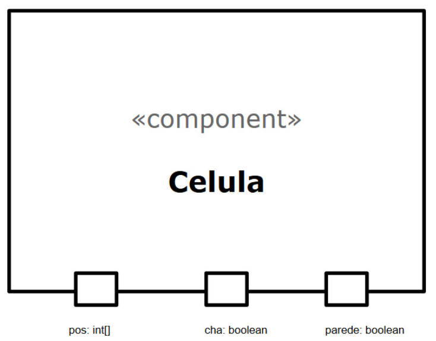
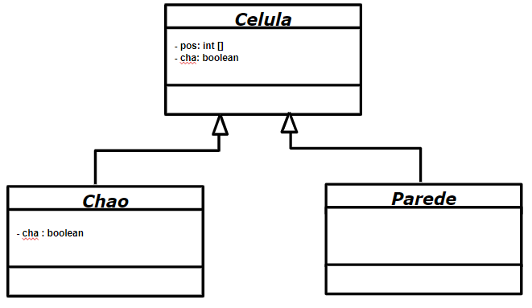

# Projeto PandemicChess
## Equipe
* Leonardo Almeida Reis - RA: 239104
* João Vitor Baptista Moreira - RA: 237833

## Descrição
Jogo de Tabuleiro com um contexto de pandemia.

## Objetivo 
Dois jogadores competem com seus times pela vitória, cada um com seu objetivo. O time dos médicos procura controlar a doença e salvar toda a população, enquanto que o time dos Infectados tenta disseminar a doença a todo custo. 

## Itens
* *Algemas:* usadas pelos médicos para colocar infectados de quarentena
* *Chá de boldo:* usada pelos médicos para vencer o jogo
* *Máscaras:* usadas pelos médicos para se proteger dos infectados
* *Baús:* estão espalhados aleatoriamente pelo mapa e carregam um dos 3 tipos de itens

## Vídeo do Projeto
[Explicação do Projeto](https://www.youtube.com/watch?v=WkQB7zuo9eI)

## Slides do Projeto
[Link dos Slides](https://docs.google.com/presentation/d/1KDkpZwINmNoawVvCUoEiNdXEPe-MgW5p7afNmaXl2f0/edit#slide=id.p)

## Diagrama Geral de Componentes


## Componente Peca


### Interfaces


Campo | Valor
----- | -----
Classe | `<caminho completo da classe com pacotes>`
Autores | Leonardo Reis e João Vitor
Objetivo | Representar as peças que serão movidas no tabuleiro
Interface | `<interface em Java do componente>`
```java
  public interface ICha{
    int[] getCha(Tabuleiro tab);
  }
  public interface IMovimento{
    boolean verificarMovimento(int x_final, int y_final);
  }
  public interface IPeca extends ICha, IMovimento{
    int[] getCha(Tabuleiro tab);
  boolean verificarMovimento(int x_final, int y_final);
  void atacar(Peca inimigo);	
  }
```

### Detalhamento das Interfaces
* **Interface IMovimento**

Interface que lida com os movimento no Tabuleiro
Método | Objetivo
------ | --------
`verificar_movimento` | Recebe como parâmetro as coordenadas do posição final e retorna true se for                           possível fazer o movimento ou false caso contrário.


* **Interface ICha**

Interface que lida com a posição do Chá (item único) no Tabuleiro
Método | Objetivo
------ | --------
`getCha` | Recebe como parâmetro o tabuleiro  e retorna um vetor de inteiros contendo as coordenadas            x,y do chá.


* **Interface IPeca**

Interface que lida com o ataque entre as peças próximas
Método | Objetivo
------ | --------
`atacar` | Recebe como parâmetro a peça que será atacada e retorna false se nenhuma peça foi alterada             e true se uma peça foi infectada ou colocada em quarentena

## Componente Tabuleiro


### Interfaces


Campo | Valor
----- | -----
Classe | `<caminho completo da classe com pacotes>`
Autores | Leonardo Reis e João Vitor
Objetivo | Gerenciar movimentos e células no espaço
Interface | `<interface em Java do componente>`
```java
  public interface ICha{
    int[] getCha(Tabuleiro tab);
  }
```

### Detalhamento das Interfaces
* **Interface ICha**

Interface que lida com a posição do Chá (item único) no Tabuleiro
Método | Objetivo
------ | --------
`getCha` | Recebe como parâmetro o tabuleiro  e retorna um vetor de inteiros contendo as coordenadas            x,y do chá.


## Componente Celula




Campo | Valor
----- | -----
Classe | `<caminho completo da classe com pacotes>`
Autores | Leonardo Reis e João Vitor
Objetivo | Representar cada subdivisão do tabuleiro
Interface | `<interface em Java do componente>`


