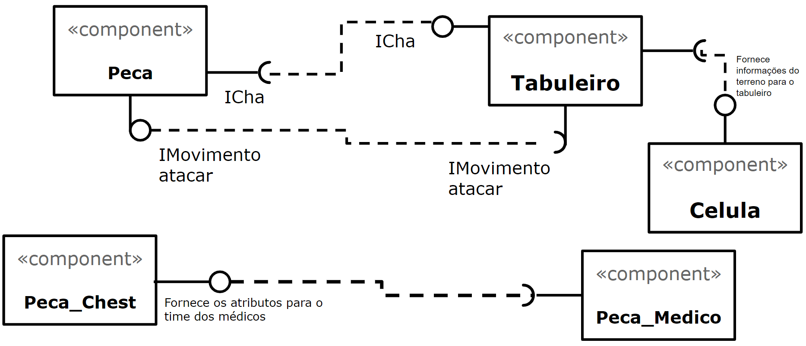
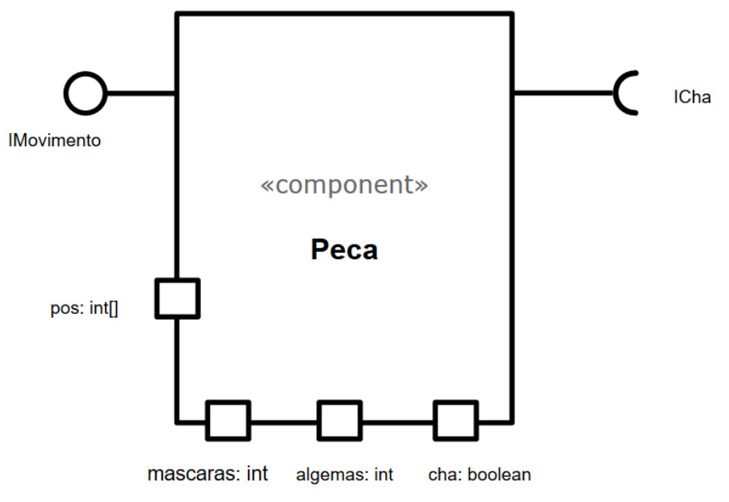
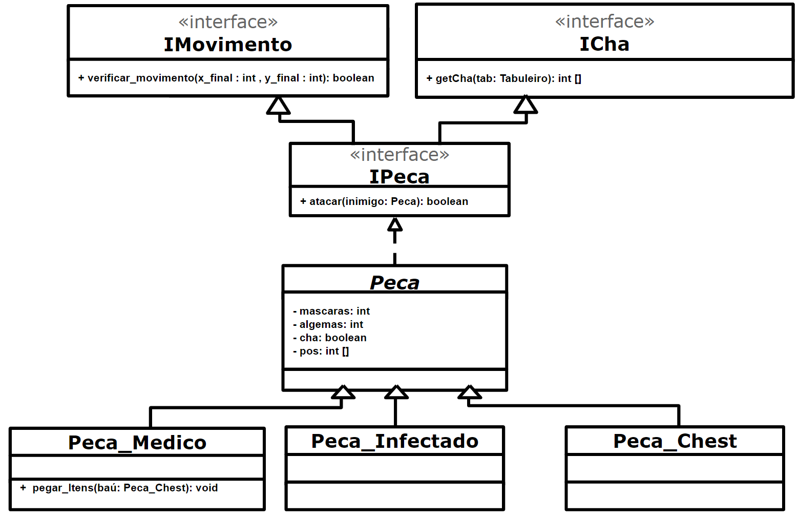
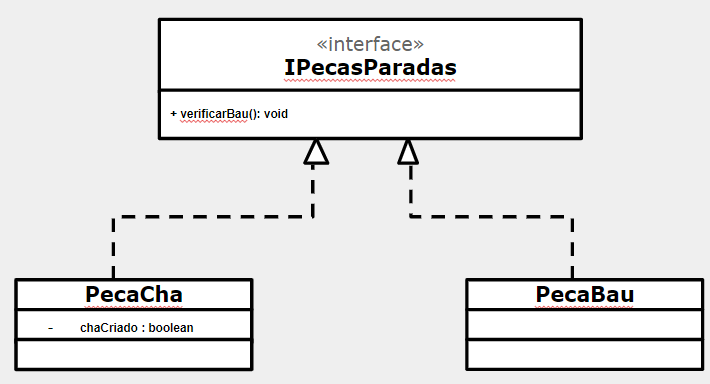

# Projeto PandemicChess
## Equipe
* Leonardo Almeida Reis - RA: 239104
* João Vitor Baptista Moreira - RA: 237833

## Descrição
Jogo de Tabuleiro com um contexto de pandemia.

## Objetivo 
Dois jogadores competem com seus times pela vitória, cada um com seu objetivo. O time dos médicos procura controlar a doença e salvar toda a população, enquanto que o time dos Infectados tenta disseminar a doença a todo custo. 

## Itens
* **Algemas:** usadas pelos médicos para colocar infectados de quarentena
* **Chá de boldo:** usada pelos médicos para vencer o jogo
* **Máscaras:** usadas pelos médicos para se proteger dos infectados
* **Baús:** estão espalhados aleatoriamente pelo mapa e carregam um dos 3 tipos de itens

## Interações entre Entidades do Tabuleiro
* **Adquirir Item do Baú:** Ao chegar na vizinhança do baú, o médico adquire um dos seguintes itens: Máscara, Algema, Chá de Boldo.
* **Adquirir Chá de Boldo** (Cura): Caso um médico seja infectado com o Chá de Boldo na mão, esse item é largado no chão (na mesma célula onde ele se encontra) e pode ser coletado por um médico que chegue em sua vizinhança.
* **Perder Máscaras:** Caso um jogador saudável esteja a menos de duas casas de distância de um jogador infectado, ele perde uma máscara.
* **Infecção:** Se não tiver mais máscaras e estiver próximo de um jogador infectado, o jogador passa a ser do time dos infectados.
* **Quarentena:** Se um jogador com algema chegar na vizinhança de um jogador infectado, esse jogador entra em quarentena e sai do mapa. 
* **Cura do vírus:** Se um jogador chegar ao hospital com a cura do vírus(chá de boldo), o time dos médicos ganha.
* **Lockdown:** Se só sobram médicos no mapa, os médicos ganham.
* **Genocídio:** Se só sobram infectados no mapa, os Infectados ganham.

## Vídeo do Projeto
[Explicação do Projeto](https://www.youtube.com/watch?v=WkQB7zuo9eI)

## Slides do Projeto
[Link dos Slides](https://docs.google.com/presentation/d/1KDkpZwINmNoawVvCUoEiNdXEPe-MgW5p7afNmaXl2f0/edit#slide=id.p)

## Diagrama Geral de Componentes


## Componente Peca


### Interfaces


Campo | Valor
----- | -----
Classe | `<caminho completo da classe com pacotes>`
Autores | Leonardo Reis e João Vitor
Objetivo | Representar as peças que serão movidas no tabuleiro
Interface | `<interface em Java do componente>`
```java
  public interface ICha{
    int[] getCha(Tabuleiro tab);
  }
  public interface IMovimento{
    boolean verificarMovimento(int x_final, int y_final);
  }
  public interface IPeca extends ICha, IMovimento{
    int[] getCha(Tabuleiro tab);
  boolean verificarMovimento(int x_final, int y_final);
  void atacar(Peca inimigo);	
  }
```

### Detalhamento das Interfaces
* **Interface IMovimento**

Interface que lida com os movimento no Tabuleiro
Método | Objetivo
------ | --------
`verificar_movimento` | Recebe como parâmetro as coordenadas do posição final e retorna true se for possível fazer o movimento ou false caso contrário.


* **Interface ICha**

Interface que lida com a posição do Chá (item único) no Tabuleiro
Método | Objetivo
------ | --------
`getCha` | Recebe como parâmetro o tabuleiro  e retorna um vetor de inteiros contendo as coordenadas            x,y do chá.


* **Interface IPeca**

Interface que lida com o ataque entre as peças próximas
Método | Objetivo
------ | --------
`atacar` | Recebe como parâmetro a peça que será atacada e retorna false se nenhuma peça foi alterada             e true se uma peça foi infectada ou colocada em quarentena


## Componente Tabuleiro

### Interfaces
* **Interface IMovimento**


Campo | Valor
----- | -----
Classe | `<caminho completo da classe com pacotes>`
Autores | Leonardo Reis e João Vitor
Objetivo | Lidar com os movimentos das peças no Tabuleiro
Interface | `<interface em Java do componente>`

* **Interface IAtaque**


Campo | Valor
----- | -----
Classe | `<caminho completo da classe com pacotes>`
Autores | Leonardo Reis e João Vitor
Objetivo | Lidar com as mecânicas de ataque entre as peças
Interface | `<interface em Java do componente>`

* **Interface IGuardaCha**

Campo | Valor
----- | -----
Classe | `<caminho completo da classe com pacotes>`
Autores | Leonardo Reis e João Vitor
Objetivo | Guardar o Chá dentro de uma PecaBau
Interface | `<interface em Java do componente>`

### Detalhamento das Interfaces
* **Interface IMovimento**
Interface que lida com os movimento no Tabuleiro
Método | Objetivo
------ | --------
`movimento` | Recebe como parâmetro as coordenadas do posição final e retorna true se for possível fazer o movimento ou false caso contrário.

* **Interface IAtaque**
Interface que lida com as mecânicas de ataque entre peças
Método | Objetivo
------ | --------
`atacar` | Recebe a peça inimiga como parâmetro e realiza o ataque à essa peça e retorna void

* **Interface ICriaCha**

Interface que cria o PecaCha no Tabuleiro
Método | Objetivo
------ | --------
`criaCha` | Recebe o próprio Tabuleiro e verifica se o número mínimo de rodadas da partida já foi atingido e tenta criar o chá. Retorna void

## Componente PecasMoveis

### Interfaces
* **Interface IMovimento**


Campo | Valor
----- | -----
Classe | `<caminho completo da classe com pacotes>`
Autores | Leonardo Reis e João Vitor
Objetivo | Lidar com os movimentos das peças no Tabuleiro
Interface | `<interface em Java do componente>`

* **Interface IAtaque**


Campo | Valor
----- | -----
Classe | `<caminho completo da classe com pacotes>`
Autores | Leonardo Reis e João Vitor
Objetivo | Lidar com as mecânicas de ataque entre as peças
Interface | `<interface em Java do componente>`

### Detalhamento das Interfaces
* **Interface IMovimento**

Interface que lida com os movimento no Tabuleiro
Método | Objetivo
------ | --------
`movimento` | Recebe como parâmetro as coordenadas do posição final e caso o Tabuleiro verifique que o movimento é válido, a peça executa o movimento

* **Interface IAtaque**

Interface que lida com as mecânicas de ataque entre peças
Método | Objetivo
------ | --------
`atacar` | Recebe a peça como parametro, verifica se ela é diferente de null e inimiga, caso passe pelas condições chama o Tabuleiro para que este execute o ataque à peça inimiga.

## Componente PecaMedico

### Interfaces
* **Interface ITransferir**


Campo | Valor
----- | -----
Classe | `<caminho completo da classe com pacotes>`
Autores | Leonardo Reis e João Vitor
Objetivo | Lidar com as transferências de itens entre uma PecaBau e uma PecaMedico 
Interface | `<interface em Java do componente>`

### Detalhamento de Interfaces
* **Interface ITransferir**

Interface que lida com as transferências de itens entre uma PecaBau e uma PecaMedico
Método | Objetivo
------ | --------
`transferirItens` | Recebe a própria PecaMedico como parâmetro e verifica os PecaBau próximos. Caso encontre um PecaBau suficientemente próximo chama este para executar a transferêcia de itens. Retorna void

## Componente PecaBau

### Interfaces
* **Interface ITransferir**


Campo | Valor
----- | -----
Classe | `<caminho completo da classe com pacotes>`
Autores | Leonardo Reis e João Vitor
Objetivo | Lidar com as transferências de itens entre uma PecaBau e uma PecaMedico 
Interface | `<interface em Java do componente>`

* **Interface IGuardaCha**


Campo | Valor
----- | -----
Classe | `<caminho completo da classe com pacotes>`
Autores | Leonardo Reis e João Vitor
Objetivo | Guardar o Chá dentro de uma PecaBau
Interface | `<interface em Java do componente>`


### Detalhamento de Interfaces
* **Interface ITransferir**

Interface que lida com as transferências de itens entre uma PecaBau e uma PecaMedico
Método | Objetivo
------ | --------
`transferirItens` | Recebe a PecaMedico como parâmetro e executa a transferência dos itens contidos na PecaBau para a PecaMedico. Retorna void

* **Interface IGuardaCha**

Interface que guarda o chá em uma PecaBau
Método | Objetivo
------ | --------
`verificarBau` | Guarda o PecaCha dentro do PecaBau correspondente. Retorna void

## Componente PecaCha

### Interfaces
* **Interface IGuardaCha**


Campo | Valor
----- | -----
Classe | `<caminho completo da classe com pacotes>`
Autores | Leonardo Reis e João Vitor
Objetivo | Guardar o Chá dentro de uma PecaBau
Interface | `<interface em Java do componente>`

* **Interface ICriaCha**


Campo | Valor
----- | -----
Classe | `<caminho completo da classe com pacotes>`
Autores | Leonardo Reis e João Vitor
Objetivo | Guardar o Chá dentro de uma PecaBau
Interface | `<interface em Java do componente>`

### Detalhamento de Interfaces
* **Interface IGuardaCha**

Interface que guarda o chá em uma PecaBau
Método | Objetivo
------ | --------
`verificarBau` | Verifica se o Chá está dentro de uma PecaBau (mesma célula), caso esteja na mesma célula chama a PecaBau para guardá-lo neste. Retorna void.

* **Interface ICriaCha**

Interface que cria o PecaCha no Tabuleiro
Método | Objetivo
------ | --------
`criaCha` | Recebe o próprio Tabuleiro e cria a PecaCha no jogo, que deve ser única. Retorna void
