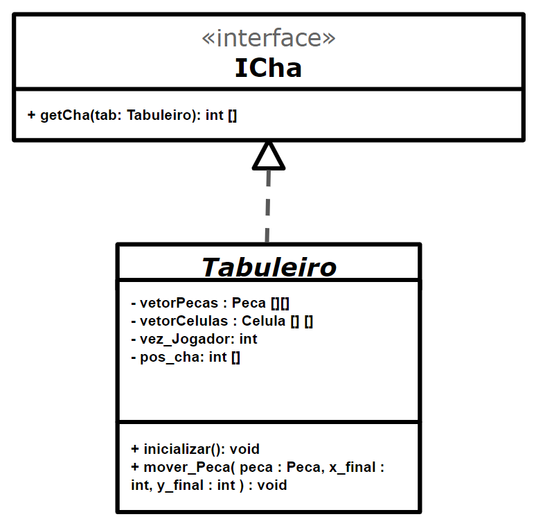
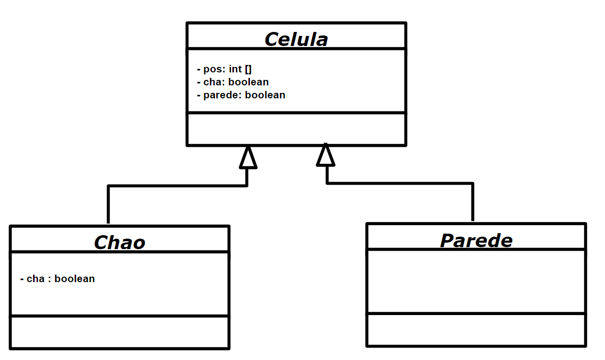

# Projeto PandemicChess
## Equipe
* Leonardo Almeida Reis - RA: 239104
* João Vitor Baptista Moreira - RA: 237833

## Descrição
Jogo de Tabuleiro com um contexto de pandemia.

## Vídeo do Projeto
[Explicação do Projeto](https://www.youtube.com/watch?v=WkQB7zuo9eI)

## Diagrama Geral de Componentes

## Componente Peca
### Interfaces

Campo | Valor
----- | -----
Classe | `<caminho completo da classe com pacotes>`
Autores | Leonardo Reis e João Vitor
Objetivo |
Interface | `código das interfaces`

## Componente Tabuleiro
### Interfaces

Campo | Valor
----- | -----
Classe | `<caminho completo da classe com pacotes>`
Autores | Leonardo Reis e João Vitor
Objetivo |
Interface | `código das interfaces`

## Componente Celula

Campo | Valor
----- | -----
Classe | `<caminho completo da classe com pacotes>`
Autores | Leonardo Reis e João Vitor
Objetivo |
Interface | `código das interfaces`

### Detalhamento das Interfaces
* **Interface IMovimento**

Interface que lida com os movimento no Tabuleiro
Método | Objetivo
------ | --------
`verificar_movimento` | Recebe como parâmetro as coordenadas do posição final e retorna true se for                           possível fazer o movimento ou false caso contrário.

* **Interface ICha**

Interface que lida com a posição do Chá (item único) no Tabuleiro
Método | Objetivo
------ | --------
`getCha` | Recebe como parâmetro o tabuleiro  e retorna um vetor de inteiros contendo as coordenadas            x,y do chá.

* **Interface IPeca**

Interface que lida com o ataque entre as peças próximas
Método | Objetivo
------ | --------
`atacar` | Recebe como parâmetro a peça que será atacada e retorna false se nenhuma peça foi alterada             e true se uma peça foi infectada ou colocada em quarentena

