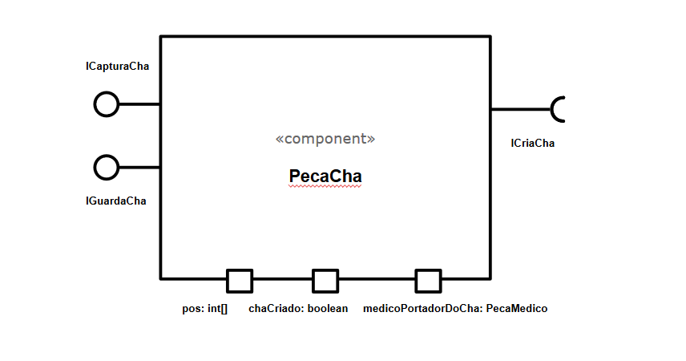

# Projeto PandemicChess
## Equipe
* Leonardo Almeida Reis - RA: 239104
* João Vitor Baptista Moreira - RA: 237833

## Descrição
Jogo de tabuleiro com contexto de pandemia

## Objetivo 
Dois jogadores competem com seus times pela vitória, cada um com seu objetivo. O time dos médicos procura controlar a doença e salvar toda a população, enquanto que o time dos Infectados tenta disseminar a doença a todo custo. 

## Itens
* **Algemas:** usadas pelos médicos para colocar infectados de quarentena
* **Chá de boldo:** usada pelos médicos para vencer o jogo
* **Máscaras:** usadas pelos médicos para se proteger dos infectados
* **Baús:** estão espalhados aleatoriamente pelo mapa e carregam um dos 3 tipos de itens

## Interações entre Entidades do Tabuleiro
* **Adquirir Item do Baú:** Ao chegar na vizinhança do baú, o médico adquire um dos seguintes itens: Máscara, Algema, Chá de Boldo.
* **Adquirir Chá de Boldo** (Cura): Caso um médico seja infectado com o Chá de Boldo na mão, esse item é largado no chão (na mesma célula onde ele se encontra) e pode ser coletado por um médico que chegue em sua vizinhança.
* **Perder Máscaras:** Caso um jogador saudável esteja a menos de duas casas de distância de um jogador infectado, ele perde uma máscara.
* **Infecção:** Se não tiver mais máscaras e estiver próximo de um jogador infectado, o jogador passa a ser do time dos infectados.
* **Quarentena:** Se um jogador com algema chegar na vizinhança de um jogador infectado, esse jogador entra em quarentena e sai do mapa. 
* **Cura do vírus:** Se um jogador chegar ao hospital com a cura do vírus(chá de boldo), o time dos médicos ganha.
* **Lockdown:** Se só sobram médicos no mapa, os médicos ganham.
* **Genocídio:** Se só sobram infectados no mapa, os Infectados ganham.

## Tutorial
**Infectados:**
* As teclas "A" e "D" mudam a seleção do personagem infectado
* Apertando "R", o infectado selecionado é escolhido para ser movido
* Por meio das teclas "W","A","S","D", o personagem se movimenta uma casa na direção escolhida

**Médicos:**
* As teclas "J" e "L" mudam a seleção do personagem medico
* Apertando "ENTER", o medico selecionado é escolhido para ser movido
* Por meio das teclas "I","J","K","L", o personagem se movimenta uma casa na direção escolhida

**Sobre a Instalação**

Como foi usado o Realtime Database do Firebase para implementar o multiplayer, é necessário que sejam importadas as bibliotecas do firebase para o projeto e para isso, utilizamos o gerenciador de pacotes Gradle. Além disso é necessário que seja criado um banco de dados próprio e que as credenciais dele sejam inseridas em um arquivo de nome "serviceAccountKey.json" na pasta principal do jogo.

# Vídeo do Projeto
## Vídeo Prévia
[Explicação do Projeto](https://www.youtube.com/watch?v=WkQB7zuo9eI)

## Vídeo do Jogo
[Explicação do Projeto](https://www.youtube.com/watch?v=-7LFomUKYqk)

# Slides do Projeto
## Slides da Prévia
[Link da Prévia dos Slides](https://docs.google.com/presentation/d/17pTjVT8FDkaQrVg6ztnDF_Xvrid9u82tG4S9LGsOXoo/edit#slide=id.g8ba9af6037_0_342)

## Slides da Apresentação Final
[Link dos Slides](https://docs.google.com/presentation/d/1KDkpZwINmNoawVvCUoEiNdXEPe-MgW5p7afNmaXl2f0/edit#slide=id.p)

## Relatório de Evolução
Inicialmente, tivemos dificuldade com a forma de organizar o projeto a partir de interfaces, uma vez que não tínhamos entendido tão bem como utilizá-las na nossa proposta de jogo. O primeiro diagrama de componentes pode ser visto abaixo:


Após alterarmos os claros problemas de organização do código, buscamos projetar um diagrama de interfaces que relacionasse melhor as entidades do jogo entre si com base nas características que tivessem em comum. No final, construímos o seguinte diagrama, com todas as entidades conectadas entre si por meio de interfaces:


Em trabalhos anteriores, tivemos como um problema o uso de variáveis de difícil compreensão, o que complicou a leitura de código e a correção dele pelo colega de equipe. Os trechos a seguir foram retiradas do Lab6: Damas 
```java
int k = 0;       // numero de pecas em risco
```
```java
int l = -1; //essa variavel me diz se a peca alvo esta em risco ou nao: 0 -> esta em risco, -1 -> nao esta em risco
(...)
if(l == -1) return;  //como a peca alvo nao esta em risco, o mov nao e valido

if (l == 0) { //pode capturar,pois a peca alvo esta em risco
```
Neste trabalho, buscamos utilizar variáveis mais autoexplicativas, mesmo que elas fossem grandes e cansativas de escrever repetidamente. Alguns exemplos podem ser vistos a seguir:
```java
public PecaMedico medicoPortadorDoCha;
```
```java
int yParedeDiagonal, xParedeDiagonal;
int yParedeFrontal, xParedeFrontal;
```

# Destaques de Código
Um dos maiores destaques do nosso código foi o uso do Firebase para implementação do multiplayer remoto:
```java
	public Firebase() {
		
	}
	
	public void iniciarFireBase() {
		FileInputStream serviceAccount = null;
		try {
			serviceAccount = new FileInputStream("./serviceAccountKey.json");
		} catch (FileNotFoundException e) {
			e.printStackTrace();
		}
		FirebaseOptions options = null;
		try {
			options = new FirebaseOptions.Builder()
			  .setCredentials(GoogleCredentials.fromStream(serviceAccount))
			  .setDatabaseUrl("https://pandemicchess-16070.firebaseio.com")
			  .build();
		} catch (IOException e) {
			e.printStackTrace();
		}

		FirebaseApp.initializeApp(options);
		
		iniciarInstanciasFireBase();
		observadorFirebase();
	}
```

Uma ténica utilizada foi utilizado um loop de repetição de 60 frames por segundo, que gerencia a atualização de informações e renderização das telas:
```java
// Controle de FPS do Jogo	
		int fps = 60;
		double nanosegundosDeUmFrame = 1000000000/fps;
		double delta = 0;
		long nanoAnterior = System.nanoTime();
		long nanoAtual;
		
		int numDeFrames = 0;
		long segPassado = System.currentTimeMillis();
		
		while(jogoRodando) {
			nanoAtual = System.nanoTime();
			delta += (nanoAtual - nanoAnterior)/nanosegundosDeUmFrame;
			nanoAnterior = nanoAtual;
			if(delta >= 1) {
				try {
					att();
				} catch (NaoVazio | ForaDeAlcance | MuitoDistante | BauVazio | ChaNaoColetado e) {
					e.printStackTrace();
				}
				renderizar();
				numDeFrames++;
				delta--;
			}
			if(System.currentTimeMillis() - segPassado >= 1000) {
				System.out.println("FPS: " + numDeFrames);
				numDeFrames = 0;
				segPassado += 1000;
			}
		}
```

Outro técnica pertinente no nosso jogo foi o uso da Spritesheet (grade de imagens) para gerenciar e centralizar as imagens do jogo em um arquivo só:
```java
	BufferedImage spritesheet;
	
	public Spritesheet(String endereco) {
	
			try {
				spritesheet = ImageIO.read(getClass().getResource(endereco));
			} catch (IOException e) {
				e.printStackTrace();
			}			
	}
	
	public BufferedImage getSprite(int x, int y, int largura, int altura) {
		return (spritesheet.getSubimage(x, y, largura, altura));
	}
```

# Conclusões e Trabalhos Futuros
No final do projeto, ficou evidente a importância de deixar o código sempre o mais limpo possível e com variáveis e comentários fáceis de serem compreendidos por terceiros. Além disso, o uso de funções que generalizam as interações entre os componentes gera uma organização bastante útil na hora de escrever e compreender o código. Para o futuro, seria interessante a utilização de design patterns para isolar uma função específica de um certo componente, para que futuras atualizações não interfiram nas funcionalidades de outras partes, além de facilitar o debugging do jogo.

# Diagramas
## Hierarquia de classes


## Diagrama Geral de Componentes


## Componente Tabuleiro


### Interfaces


Campo | Valor
----- | -----
Classe | `<caminho completo da classe com pacotes>`
Autores | Leonardo Reis e João Vitor
Objetivo | Organizar as Celulas e Pecas em vetores 
Interface | `<interface em Java do componente>`
```java
public interface IMovimento{
	boolean verificarMovimento(int x_final, int y_final, PecasMoveis peca, Tabuleiro tab);
}
public interface IAtaque{
	void atacar(PecasMoveis inimigo, Tabuleiro tab);
}
public interface ICriaCha{
	void criaCha();
}
```

### Detalhamento das Interfaces
* **Interface IMovimento**

Interface que lida com os movimento no Tabuleiro
Método | Objetivo
------ | --------
`movimento` | Recebe como parâmetro as coordenadas do posição final, a peça a ser movida e o tabuleiro e retorna true se for possível fazer o movimento ou false caso contrário.

* **Interface IAtaque**

Interface que lida com as mecânicas de ataque entre peças
Método | Objetivo
------ | --------
`atacar` | Recebe a peça inimiga e o tabuleiro como parâmetro e realiza o ataque à essa peça. Retorna void

* **Interface ICriaCha**

Interface que cria o PecaCha no Tabuleiro
Método | Objetivo
------ | --------
`criaCha` | Verifica se o número mínimo de rodadas da partida já foi atingido e tenta criar o chá. Retorna void

## Componente PecasMoveis


### Interfaces


Campo | Valor
----- | -----
Classe | `<caminho completo da classe com pacotes>`
Autores | Leonardo Reis e João Vitor
Objetivo | Representar as Pecas que semovimentam pelo tabuleiro
Interface | `<interface em Java do componente>`
```java
public interface IMovimento{
	boolean verificarMovimento(int x_final, int y_final, PecasMoveis peca, Tabuleiro tab);
}
public interface IAtaque{
	void atacar(Peca inimigo,Tabuleiro tab);
}
```

### Detalhamento das Interfaces
* **Interface IMovimento**

Interface que lida com os movimento no Tabuleiro
Método | Objetivo
------ | --------
`movimento` | Recebe como parâmetro as coordenadas do posição final, a peça e o tabuleiro e caso o Tabuleiro verifique que o movimento é válido, a peça executa o movimento.

* **Interface IAtaque**

Interface que lida com as mecânicas de ataque entre peças
Método | Objetivo
------ | --------
`atacar` | Recebe a peça como parametro, verifica se ela é diferente de null e inimiga, caso passe pelas condições chama o Tabuleiro, que também é passado como parâmetro, para que este execute o ataque à peça inimiga. Retorna void

## Componente PecaMedico


### Interfaces


Campo | Valor
----- | -----
Classe | `<caminho completo da classe com pacotes>`
Autores | Leonardo Reis e João Vitor
Objetivo | Representar as Pecas do time dos médicos
Interface | `<interface em Java do componente>`
```java
public interface ITransferir{
	void transferirItens(PecaMedico medico, Tabuleiro tab);
}
public interface ICapturaCha{
	void pegarChaNoChao(Tabuleiro tab, PecaMedico med);
}
```
### Detalhamento de Interfaces
* **Interface ITransferir**

Interface que lida com as transferências de itens entre uma PecaBau e uma PecaMedico
Método | Objetivo
------ | --------
`transferirItens` | Recebe a própria PecaMedico e o tabuleiro como parâmetro e verifica os PecaBau próximos a ela. Caso encontre um PecaBau suficientemente próximo chama este para executar a transferêcia de itens. Retorna void

* **Interface ICapturaCha**

Interface que realiza a captura do cha no chão pelo médico

Método | Objetivo
------ | --------
`pegarChaNoChao` | Recebe a própria PecaMedico e o tabuleiro como parâmetro e verifica se o chá está nas vizinhanças. Caso esteja, muda o atributo cha para true e chama o método na PecaCha. Retorna void
## Componente PecaBau


### Interfaces


Campo | Valor
----- | -----
Classe | `<caminho completo da classe com pacotes>`
Autores | Leonardo Reis e João Vitor
Objetivo | Representar os baús que gardam itens no jogo
Interface | `<interface em Java do componente>`
```java
public interface ITransferir{
	void transferirItens(PecaMedico medico, Tabuleiro tab);
}
public interface IGuardaCha{
	void verificarBau(Tabuleiro tab);
}
```

### Detalhamento de Interfaces
* **Interface ITransferir**

Interface que lida com as transferências de itens entre uma PecaBau e uma PecaMedico
Método | Objetivo
------ | --------
`transferirItens` | Recebe a PecaMedico e o tabuleiro como parâmetro e executa a transferência dos itens contidos na PecaBau para a PecaMedico. Retorna void

* **Interface IGuardaCha**

Interface que guarda o chá em uma PecaBau
Método | Objetivo
------ | --------
`verificarBau` | Guarda o PecaCha dentro do PecaBau correspondente. Retorna void

## Componente PecaCha


### Interfaces


Campo | Valor
----- | -----
Classe | `<caminho completo da classe com pacotes>`
Autores | Leonardo Reis e João Vitor
Objetivo | Representar o item chá de boldo
Interface | `<interface em Java do componente>`
```java
public interface IGuardaCha{
	void verificarBau(Tabuleiro tab);
}
public interface ICriaCha{
	void criaCha();
}
public interface ICapturaCha{
	void pegarChaNoChao(Tabuleiro tab, PecaMedico med);
}
```

### Detalhamento de Interfaces
* **Interface IGuardaCha**

Interface que guarda o chá em uma PecaBau
Método | Objetivo
------ | --------
`verificarBau` | Verifica se o Chá está dentro de uma PecaBau (mesma célula), caso esteja na mesma célula chama a PecaBau para guardá-lo neste. Retorna void.

* **Interface ICriaCha**

Interface que cria o PecaCha no Tabuleiro
Método | Objetivo
------ | --------
`criaCha` | Cria a PecaCha no jogo, que deve ser única. Retorna void

* **Interface ICapturaCha**

Interface que realiza a captura do cha no chão pelo médico
Método | Objetivo
------ | --------
`pegarChaNoChao` | Recebe como parâmetro uma PecaMedico, que é atribída ao medicoPortadorDoCha. Retorna void

# Plano de Exceções

## Diagrama da hierarquia de exceções


## Descrição das classes de exceção

Classe | Descrição 
------ | ---------
ErroMovimento | Engloba todos os erros relacionados ao movimento de pecas
ForaDeAlcance | Esse erro ocorre quando o jogador tenta se mover para fora do tabuleiro
NaoVazio | Esse erro ocorre quando o jogador tenta se mover para uma casa não-vazia do tabuleiro
MuitoDistante | Esse erro ocorre quando o jogador tenta mover uma peça em mais de uma casa
ForaDoTurno | Esse erro ocorre quando o jogador tenta se mover quando não é a sua vez
BauVazio | Esse erro ocorre quando um médico tenta pegar itens de um baú quando ele está vazio
ChaNaoColetado | Esse erro ocorre quando um médico chega ao hospital sem o chá
